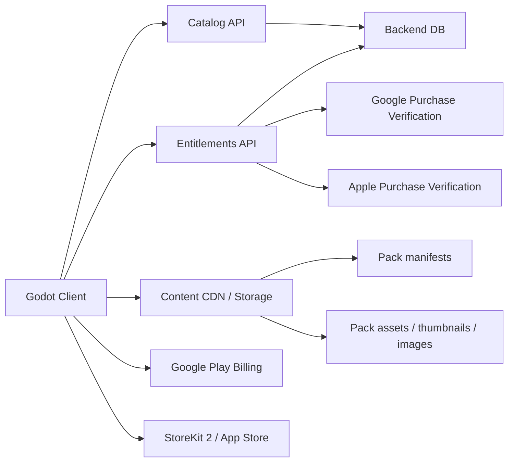

# Arquitectura de suscripcion, catalogo vivo y delivery remoto

Fecha: 2026-03-08
Proyecto: Puzzle Tiki Tiki

## 1. Objetivo

Definir la arquitectura objetivo del juego para soportar:

- Juego gratuito con un catalogo free rotatorio.
- Suscripcion premium con acceso a todo el catalogo historico.
- Packs y puzzles exclusivos para premium.
- Packs temporales gratuitos y premium.
- Desafios diarios con imagenes nuevas.
- Futuro soporte de cosmeticos.
- Publicacion en Android e iOS.

La conclusion principal es esta:

- El juego no debe depender de contenido embebido en el binario para todo.
- La arquitectura recomendada es hibrida:
  - contenido base embebido para bootstrap y primer uso;
  - catalogo remoto gobernado por backend;
  - assets descargables y cacheados localmente;
  - entitlements controlados por backend y verificados contra Apple/Google.

## 2. Estado actual del proyecto

### 2.1 Lo que ya existe y se puede aprovechar

- El juego ya esta estructurado por packs y puzzles.
- Ya existe progreso por pack y puzzle.
- Ya existe una base de DLC descargable.
- Ya existe una capa de commerce separada de la jugabilidad.
- Ya existe UI para tienda/compra.

Archivos relevantes:

- `Scripts/Autoload/ProgressManager.gd`
- `PacksData/sample_packs.json`
- `dlc/new_base_packs.json`
- `Modules/dlc/DLCService.gd`
- `Modules/commerce/IAPService.gd`
- `Modules/commerce/EntitlementsService.gd`

### 2.2 Problemas actuales que impiden el modelo objetivo

- Hay dos sistemas de compra coexistiendo:
  - `IapService` antiguo en `Modules/dlc/downloadService.gd`
  - `IAPService` nuevo en `Modules/commerce/IAPService.gd`
- `FREE_TO_PLAY_MODE = true` fuerza el acceso gratuito a todo el contenido y rompe cualquier prueba real de acceso free/premium.
- El flujo actual esta pensado para compra permanente por pack, no para suscripcion recurrente.
- El proveedor real solo existe para Google Play Billing. iOS no tiene proveedor equivalente integrado en el runtime actual.
- `dlc/base_url` esta vacio, por tanto la descarga remota no esta configurada.
- En Android el permiso `INTERNET` esta desactivado en los presets actuales, por lo que hoy no puede funcionar un catalogo remoto real.
- La tienda mezcla el flujo antiguo y el nuevo.
- El JSON de packs mezcla catalogo, compra, progreso y estado de despliegue. Eso no escala para rotacion mensual ni para eventos.

## 3. Recomendacion de producto

### 3.1 Modelo de acceso recomendado

Se recomienda simplificar a este esquema:

- Free:
  - 12 packs activos cada mes.
  - 1 pack nuevo free al mes.
  - sale 1 pack free antiguo al mes.
  - acceso a desafios diarios.
  - algunos packs temporales/eventos marcados como free.
- Premium:
  - acceso a todo el catalogo historico publicado.
  - acceso al pack premium del mes.
  - acceso a packs y puzzles exclusivos.
  - acceso a eventos premium.
  - acceso a cosmeticos exclusivos.

### 3.2 Lo que NO recomiendo para la primera version

- Mezclar suscripcion premium y venta individual de packs desde el dia 1.
- Mantener el modelo antiguo de `purchased = true/false` como criterio principal de acceso.
- Publicar nuevo contenido solo con actualizaciones del binario.

La razon es simple:

- complica producto;
- complica UX;
- complica backend;
- complica restauracion de compras;
- complica compatibilidad entre Android e iOS.

## 4. Arquitectura objetivo



### 4.1 Separacion de responsabilidades

El sistema debe separar 4 capas:

- Catalogo:
  - que packs existen;
  - si son free, premium, temporales o diarios;
  - que fechas de activacion tienen.
- Entitlements:
  - si el usuario tiene premium activo;
  - si posee cosmeticos;
  - si tiene grants especiales.
- Delivery/cache:
  - que contenido esta descargado;
  - que version tiene;
  - checksum;
  - fecha de expiracion.
- Progreso:
  - puzzles completados;
  - estadisticas;
  - desafios diarios hechos;
  - cosmeticos equipados.

## 5. Decision sobre contenido embebido vs remoto

### 5.1 Recomendacion

Usar una estrategia hibrida:

- Embebido en el juego:
  - menu;
  - gameplay;
  - tutorial;
  - UI;
  - 1 a 3 packs de bootstrap;
  - imagenes placeholder y fallback;
  - texto basico de tienda;
  - pantallas de error/offline.
- Remoto:
  - rotacion mensual free;
  - packs premium;
  - packs temporales;
  - daily challenges;
  - thumbnails y assets nuevos;
  - configuracion de merchandising y cosmeticos.

### 5.2 Por que no meter todo dentro del juego

- Requiere update de app para cada pack nuevo.
- Rompe la agilidad del modelo rotatorio.
- Complica daily challenges.
- Aumenta el peso del binario.
- Hace mas lenta la iteracion y el review en stores.

### 5.3 Por que no hacer todo remoto

- Mal primer arranque sin red.
- Peor experiencia en review/test.
- Mas puntos de fallo.
- Mas complejidad para onboarding.

## 6. Plugins oficiales y decision tecnica actual

### 6.1 Android

Plugin recomendado:

- `godot-sdk-integrations/godot-google-play-billing`

Hallazgos:

- El README oficial indica que `master` soporta Godot 4.2+.
- El README oficial indica instalacion en `addons/GodotGooglePlayBilling/`.
- La release listada mas reciente visible es `v3.1.0`.
- La `v3.0.0` introdujo Billing Library 8.0.0.
- La `v3.1.0` actualiza el plugin a Godot 4.5.1 y anade `open_subscriptions_page`.

Impacto para este proyecto:

- Tu wrapper actual de Android no debe seguir atado a la API vieja/autoload anterior.
- Hay que adaptar `Modules/commerce/providers/GooglePlayBillingProvider.gd` al API actual del plugin oficial.
- Conviene soportar `subs` como tipo por defecto para premium.
- La integracion moderna del repo trae un wrapper GDScript `BillingClient.gd` dentro del propio plugin.
- Ese wrapper soporta directamente:
  - `query_product_details(...)`
  - `query_purchases(...)`
  - `purchase_subscription(product_id, base_plan_id, offer_id)`
  - `update_subscription(...)`
  - `open_subscriptions_page(...)`
- Esto encaja mejor con tu caso que el provider actual del proyecto.

### 6.2 iOS

Opcion recomendada para suscripciones:

- `godot-sdk-integrations/godot-storekit2`

Hallazgos:

- El repo se presenta explicitamente como plugin de StoreKit 2 para compras in-app y suscripciones.
- La release visible mas reciente es `v0.2` de 2025-09-18.
- El propio repo advierte que sigue en desarrollo y que la API no es estable.
- La instalacion real se hace en `ios/plugins/`, no en `addons/`.
- La clase se expone en runtime como `GodotStoreKit2` y el wrapper local del repo usa `ClassDB.instantiate("GodotStoreKit2")`.
- El plugin ya expone estados utiles para suscripciones:
  - `PURCHASED`
  - `RESTORED`
  - `REFUNDED`
  - `EXPIRED`
  - `PENDING`
  - `CANCELED`

Alternativa mas conservadora:

- `godot-sdk-integrations/godot-ios-plugins` plugin `InAppStore`

Pros:

- historicamente mas conocido;
- encaja con el ecosistema clasico de plugins iOS de Godot.

Contras:

- usa la API original de StoreKit;
- para un producto centrado en suscripciones, StoreKit 2 es mejor direccion tecnica.

### 6.3 Decision recomendada

Para este proyecto recomiendo:

- Android:
  - integrar `godot-google-play-billing` oficial.
- iOS:
  - preferir `godot-storekit2` para premium subscription;
  - mantener `InAppStore` solo como fallback si StoreKit 2 bloquea el shipping.

### 6.4 Advertencia importante

La organizacion `godot-sdk-integrations` centraliza repositorios comunitarios, pero no implica mantenimiento garantizado por la Godot Foundation. Hay que asumir que:

- puede haber cambios de API;
- puede haber periodos sin releases;
- hay que encapsular estos plugins detras de wrappers propios del proyecto.

## 7. Modelo de datos recomendado

### 7.1 Catalog manifest

Endpoint:

- `GET /v1/catalog`

Ejemplo:

```json
{
  "catalog_version": "2026-03",
  "generated_at": "2026-03-08T10:00:00Z",
  "free_rotation": {
    "slot_count": 12,
    "starts_at": "2026-03-01T00:00:00Z",
    "ends_at": "2026-03-31T23:59:59Z",
    "pack_ids": ["fruits", "spring-01", "numbers-a", "animals-03"]
  },
  "packs": [
    {
      "id": "fruits",
      "title_key": "pack_fruits_name",
      "description_key": "pack_fruits_description",
      "tier": "free_rotation",
      "tags": ["evergreen"],
      "availability": {
        "starts_at": null,
        "ends_at": null
      },
      "content_version": "3",
      "thumbnail_url": "https://cdn.example.com/packs/fruits/thumb_v3.png",
      "manifest_url": "https://cdn.example.com/packs/fruits/manifest_v3.json",
      "estimated_download_mb": 18
    },
    {
      "id": "premium-march-2026",
      "title_key": "pack_premium_march_2026_name",
      "description_key": "pack_premium_march_2026_description",
      "tier": "premium_only",
      "tags": ["monthly", "exclusive"],
      "availability": {
        "starts_at": "2026-03-01T00:00:00Z",
        "ends_at": null
      },
      "content_version": "1",
      "thumbnail_url": "https://cdn.example.com/packs/premium-march-2026/thumb_v1.png",
      "manifest_url": "https://cdn.example.com/packs/premium-march-2026/manifest_v1.json",
      "estimated_download_mb": 22
    }
  ]
}
```

### 7.2 Pack manifest

Endpoint:

- `GET /v1/content/packs/{pack_id}/manifest`

Ejemplo:

```json
{
  "pack_id": "fruits",
  "content_version": "3",
  "checksum": "sha256:abc123",
  "puzzles": [
    {
      "id": "fruit1",
      "title_key": "fruit_lemon",
      "description_key": "fruit_lemon_description",
      "image_url": "https://cdn.example.com/packs/fruits/lemon_v3.jpg",
      "checksum": "sha256:def456"
    }
  ]
}
```

### 7.3 Entitlements

Endpoint:

- `GET /v1/entitlements`

Ejemplo:

```json
{
  "app_user_id": "uuid-local-or-account-id",
  "premium": {
    "active": true,
    "product_id": "premium_monthly",
    "platform": "android",
    "expires_at": "2026-04-07T12:00:00Z",
    "grace_period": false
  },
  "cosmetics": [
    "theme_spring_2026",
    "frame_gold"
  ],
  "grants": [
    "all_catalog_access"
  ]
}
```

### 7.4 Daily challenge

Endpoint:

- `GET /v1/challenges/daily?date=2026-03-08`

Ejemplo:

```json
{
  "challenge_id": "2026-03-08",
  "date": "2026-03-08",
  "tier": "free",
  "puzzle": {
    "id": "daily-2026-03-08",
    "title": "Daily Challenge",
    "image_url": "https://cdn.example.com/daily/2026-03-08.jpg",
    "checksum": "sha256:xyz999"
  },
  "rules": {
    "mode": "challenge",
    "rows": 6,
    "columns": 4
  }
}
```

## 8. Endpoints backend recomendados

### 8.1 Catalogo y contenido

- `GET /v1/catalog`
- `GET /v1/content/packs/{pack_id}/manifest`
- `GET /v1/challenges/daily`
- `GET /v1/challenges/upcoming`

### 8.2 Entitlements y compras

- `GET /v1/entitlements`
- `POST /v1/iap/google/verify`
- `POST /v1/iap/apple/verify`
- `POST /v1/iap/apple/notifications`
- `POST /v1/iap/google/notifications`

### 8.3 Jugador

- `POST /v1/player/progress/sync`
- `POST /v1/player/cosmetics/equip`
- `GET /v1/player/profile`

## 9. Flujos de compra y suscripcion

### 9.1 Android

Flujo recomendado:

1. El cliente consulta productos de tipo `subs`.
2. El usuario compra `premium_monthly` o `premium_yearly`.
3. El plugin devuelve el purchase token.
4. El cliente envia token al backend.
5. El backend verifica contra Google.
6. El backend persiste entitlement premium.
7. El cliente refresca `GET /v1/entitlements`.
8. El cliente desbloquea catalogo premium.

### 9.2 iOS

Flujo recomendado:

1. El cliente consulta producto StoreKit 2.
2. El usuario compra la suscripcion.
3. El plugin notifica transaccion.
4. El cliente envia transaccion/receipt al backend.
5. El backend valida contra Apple.
6. El backend persiste entitlement premium.
7. El cliente refresca `GET /v1/entitlements`.

### 9.3 Regla importante

El cliente no debe decidir acceso premium de forma canonica solo con estado local.

El estado canonico debe ser:

- backend entitlements;
- con fallback local temporal para modo offline.

## 10. Reglas de acceso recomendadas

### 10.1 Free

Puede abrir un pack si se cumple una:

- el pack esta en `free_rotation.pack_ids`;
- el pack es `seasonal_free` y esta dentro de ventana activa;
- el pack es un daily challenge activo.

### 10.2 Premium

Puede abrir un pack si se cumple una:

- entitlement premium activo;
- grant administrativo;
- pack explicitamente regalado.

### 10.3 Cuando premium expira

No borrar progreso.

Solo bloquear acceso a:

- packs premium;
- packs historicos fuera del free rotatorio;
- cosmeticos premium si decides que sean no permanentes.

Recomendacion:

- los cosmeticos premium exclusivos deberian quedar equipables solo con premium activo;
- los cosmeticos comprados individualmente pueden ser permanentes en una fase futura.

## 11. Cache y almacenamiento local

Rutas recomendadas:

- `user://catalog/catalog_manifest.json`
- `user://content/packs/<pack_id>/manifest.json`
- `user://content/packs/<pack_id>/images/...`
- `user://entitlements/state.json`
- `user://progress/progress.json`

Politica recomendada:

- mantener siempre cache del catalogo actual;
- mantener cache del daily de hoy y manana;
- purgar contenido no usado de temporadas cerradas;
- no purgar progreso aunque el contenido desaparezca del catalogo activo.

## 12. Servicios Godot a crear o refactorizar

### 12.1 Servicios nuevos

- `CatalogService`
  - descarga y cachea catalogo.
- `EntitlementService`
  - estado premium/cosmeticos.
- `ContentService`
  - manifiestos, descargas, checksums, purga.
- `SubscriptionService`
  - wrapper comun Android/iOS.
- `DailyChallengeService`
  - daily actual y upcoming.

### 12.2 Servicios a retirar o reducir

- `Modules/dlc/downloadService.gd`
  - debe retirarse como flujo principal.
- `Scripts/Components/DialogBuy/dialog_buy.gd`
  - debe retirarse; hoy simula compra masiva de DLC.

### 12.3 Servicios existentes a conservar con cambios

- `ProgressManager`
  - conservar progreso y stats;
  - quitar responsabilidad de decidir el catalogo activo;
  - dejar de usar `purchased` como verdad unica de acceso.
- `DLCService`
  - puede evolucionar hacia `ContentService` o quedar como capa de I/O de assets.
- `IAPService`
  - debe convertirse en wrapper limpio por plataforma.

## 13. Cambios inmediatos recomendados en este repo

### 13.1 Fase 0 - saneamiento

- Eliminar duplicidad conceptual entre `IapService` e `IAPService`.
- Dejar un solo punto de entrada para compras.
- Desactivar el flujo antiguo de compra simulada.
- Eliminar `FREE_TO_PLAY_MODE = true` y mover esa decision a config remota o build flag.

### 13.2 Fase 1 - plugins oficiales

- Android:
  - instalar `godot-google-play-billing`.
  - instalarlo en `addons/GodotGooglePlayBilling/`.
  - adaptar provider actual a `BillingClient.gd`.
  - pasar de `querySkuDetails` legacy a `query_product_details`.
  - soportar `purchase_subscription(product_id, base_plan_id, offer_id)`.
- iOS:
  - prototipo con `godot-storekit2`.
  - instalarlo en `ios/plugins/`.
  - crear provider iOS basado en `GodotStoreKit2`.
  - mapear sus estados nativos a un contrato comun de entitlement.
  - fallback documentado a `InAppStore` si aparece bloqueo.

### 13.3 Fase 2 - backend y catalogo

- crear `CatalogService`;
- crear `EntitlementService`;
- servir `GET /v1/catalog`;
- servir `GET /v1/entitlements`;
- resolver descarga remota real;
- activar `dlc/base_url`.

### 13.4 Fase 3 - UX de tienda

- sustituir compra por pack por pantalla `Premium`.
- mostrar:
  - beneficios premium;
  - productos mensuales/anuales;
  - restaurar compras;
  - gestionar suscripcion.

### 13.5 Fase 4 - contenido vivo

- rotacion mensual free;
- pack premium mensual;
- packs temporales;
- daily challenges;
- precache de thumbnails y daily assets.

### 13.6 Fase 5 - cosmeticos

- themes;
- marcos;
- fondos;
- skins de piezas;
- badges premium.

## 14. Ajustes tecnicos concretos a no olvidar

- Activar permiso `INTERNET` en Android export presets.
- Revisar `minSdk` y `targetSdk` para alinearlos con el plugin Android elegido.
- No confiar en que el singleton exista en editor al probar iOS.
- En iOS, probar siempre en export/Xcode y no solo en editor.
- Encapsular plugins nativos detras de wrappers propios del proyecto.
- Registrar eventos de expiracion, refund y restore.
- Preparar boton de gestionar suscripcion:
  - Android: abrir pagina de suscripciones.
  - iOS: deep link o flujo recomendado por Apple.

## 15. Riesgos

### 15.1 Riesgo principal

`godot-storekit2` es la opcion correcta conceptualmente para suscripciones en iOS, pero el propio repo advierte que la API aun no es estable.

Mitigacion:

- encapsular el plugin en un provider propio;
- no acoplar UI ni logica de negocio directamente al plugin;
- mantener `InAppStore` como plan B.

### 15.2 Riesgo de migracion

El proyecto tiene deuda previa de packs comprados vs packs desbloqueados. Si no se separa catalogo de progreso, apareceran bugs cuando un pack salga de rotacion.

Mitigacion:

- migracion de datos;
- modelo de progreso desacoplado del catalogo;
- pruebas con packs expandidos, rotados y expirados.

## 16. Roadmap propuesto

### Sprint 1

- unificar commerce;
- eliminar flujo antiguo;
- activar permisos/export config;
- integrar plugin Android oficial;
- documentar decision iOS final.

### Sprint 2

- implementar wrappers `CatalogService`, `SubscriptionService`, `EntitlementService`;
- backend minimo con `catalog` + `entitlements`;
- pantalla premium.

### Sprint 3

- rotacion mensual;
- descarga remota de packs;
- daily challenge.

### Sprint 4

- seasonal packs;
- yearly subscription;
- cosmeticos premium.

## 17. Decision final recomendada

La arquitectura recomendada para Puzzle Tiki Tiki es:

- cliente Godot con contenido base embebido;
- catalogo remoto mensual;
- assets descargables y cacheados;
- premium basado en suscripcion;
- backend canonico de entitlements;
- plugin oficial de Google Play Billing en Android;
- StoreKit 2 en iOS, con fallback a InAppStore si el plugin actual no da estabilidad suficiente.

No recomiendo seguir expandiendo el modelo actual de DLC comprado por pack. El proyecto ya ha crecido mas alla de ese modelo y tu vision de negocio necesita una capa de catalogo viva, no solo un listado de packs instalados.

## 18. Fuentes primarias revisadas

- https://github.com/godot-sdk-integrations
- https://github.com/godot-sdk-integrations/godot-google-play-billing
- https://github.com/godot-sdk-integrations/godot-google-play-billing/releases
- https://github.com/godot-sdk-integrations/godot-storekit2
- https://github.com/godot-sdk-integrations/godot-ios-plugins
- https://developer.android.com/google/play/billing/subscriptions
- https://developer.android.com/google/play/billing/security
- https://developer.apple.com/app-store/subscriptions/
- https://developer.apple.com/documentation/storekit/handling-subscriptions-billing
- https://developer.apple.com/documentation/storekit/transaction/currententitlements
