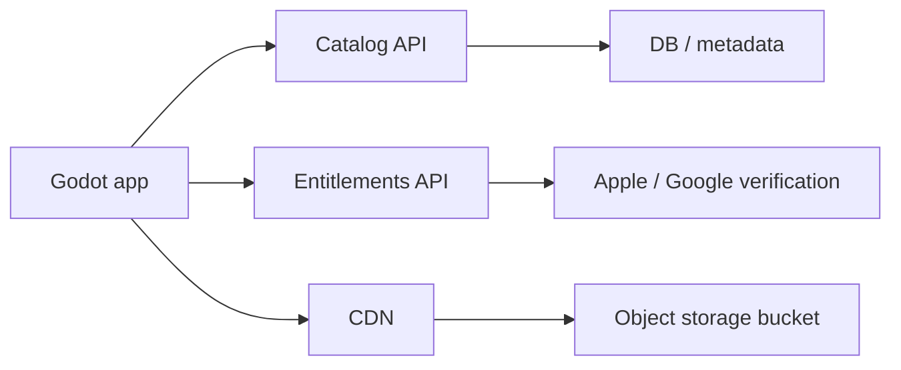

# Infraestructura de Descarga de Contenido

## Recomendación

La opción más profesional para este juego es:

1. `bucket` de objetos para assets y packs.
2. `CDN` delante del bucket.
3. `API` pequeña para catálogo, entitlements y URLs firmadas.
4. Manifiestos JSON versionados.
5. Cliente Godot que descarga, cachea en `user://` y valida checksum.

No recomiendo meter todo el contenido futuro dentro del binario de la app. Para rotación mensual, eventos temporales y desafíos diarios, eso te obligaría a publicar updates demasiado a menudo y a pasar revisión de tienda para cambios que deberían vivir en backend.

## Arquitectura recomendada



## Opción principal

La opción que te recomiendo como estándar de estudio es:

- `Amazon S3` como object storage.
- `CloudFront` como CDN.
- `Origin Access Control (OAC)` para que el bucket no sea público.
- `Signed URLs` de CloudFront para premium y contenido protegido.
- `API Gateway + Lambda` o backend propio para emitir el catálogo y firmar URLs.

Por qué:

- Es el patrón más común y estable.
- Escala bien.
- Te deja separar `assets públicos` de `assets premium`.
- Te permite invalidar acceso premium sin tocar la app.
- Tiene muy buen soporte para versionado, logs, métricas y despliegues CI/CD.

## Alternativa más barata

Si quieres costes más bajos y menos fricción operativa:

- `Cloudflare R2` como object storage.
- `Cloudflare Cache/CDN` con dominio propio.
- `Workers` o backend ligero para manifiestos y firmado HMAC/JWT.

Es buena opción para un estudio pequeño, pero si me preguntas por el patrón más “enterprise/profesional”, sigo prefiriendo `S3 + CloudFront`.

## Lo que hacen equipos serios

No exponen el bucket como “listado abierto” ni hacen que el cliente descubra archivos por su cuenta. Lo normal es:

1. El cliente pide un manifiesto de catálogo.
2. El backend responde qué packs están activos y qué tier puede ver el usuario.
3. Para contenido free, el manifiesto puede traer rutas CDN públicas.
4. Para contenido premium, el backend devuelve URLs firmadas de corta duración o un manifiesto premium firmado.
5. El cliente descarga y guarda en `user://`.
6. El cliente valida `sha256` y versión antes de usar el archivo.

## Qué publicar en el bucket

No subas un único JSON gigante. Lo mejor es separar:

- `catalog/catalog_manifest.json`
- `catalog/daily/2026-03-08.json`
- `packs/<pack-id>/pack_manifest.vN.json`
- `packs/<pack-id>/thumb.webp`
- `packs/<pack-id>/puzzles/<puzzle-id>.webp`

Ejemplo de rutas:

```text
catalog/catalog_manifest.json
catalog/daily/2026-03-08.json
packs/free-001/pack_manifest.v3.json
packs/free-001/thumb.webp
packs/free-001/puzzles/free-001-puzzle-01.webp
packs/premium-archive-001/pack_manifest.v7.json
```

## Política de caché

La clave profesional está aquí:

- Manifiestos: TTL corto.
  - Ejemplo: `Cache-Control: public, max-age=300`
- Assets versionados: TTL largo e inmutable.
  - Ejemplo: `Cache-Control: public, max-age=31536000, immutable`

Si cambias una imagen, no sobrescribas el mismo asset “a pelo”. Sube una nueva revisión o cambia la ruta/version.

## Free vs Premium

Hazlo así:

- `Free`
  - catálogo público o casi público;
  - assets de packs gratuitos servidos por CDN sin firma, si quieres simplificar.
- `Premium`
  - catálogo filtrado por backend;
  - URLs firmadas de corta duración;
  - entitlement validado en servidor.

Esto evita que un usuario con una app modificada pueda descubrir assets premium solo porque estaban en un bucket abierto.

## Daily challenges

Los desafíos diarios no deberían estar embebidos en la app. La forma correcta:

- backend genera `daily/<date>.json`;
- el cliente descarga hoy y opcionalmente mañana;
- cache local de 1-3 días;
- si el asset no existe localmente, se descarga en el momento.

## Pipeline de publicación

La manera profesional de operar esto es:

1. Preparas nuevas imágenes y `pack_manifest`.
2. Un script genera hashes `sha256` y tamaños.
3. El pipeline sube assets al bucket.
4. El pipeline publica o actualiza `catalog_manifest.json`.
5. El backend marca si ese pack es `free_rotating`, `premium`, `seasonal` o `daily`.
6. La CDN sirve el contenido con la política de caché adecuada.

## Backend mínimo

Como mínimo deberías tener estos endpoints:

- `GET /v1/catalog`
- `GET /v1/catalog/daily/{date}`
- `GET /v1/entitlements`
- `POST /v1/content/sign`

`/v1/content/sign` sirve para que el backend te devuelva una URL firmada para premium si no quieres exponer la ruta directa.

## Seguridad

No confíes en el cliente para decidir si un usuario es premium.

Haz esto:

- Android: verificas compra/suscripción en backend.
- iOS: verificas transacción/suscripción en backend.
- backend emite el estado de entitlement.
- solo con entitlement activo emites URLs firmadas premium.

## Qué recomiendo para tu caso

Para este juego concreto:

- base mínima embebida en la app;
- catálogo remoto en JSON;
- packs e imágenes en object storage + CDN;
- bucket privado para premium;
- free servido desde CDN;
- premium servido con URLs firmadas;
- desafíos diarios generados por backend;
- caché local en `user://catalog` y `user://dlc`.

## Qué NO haría

- No usaría Google Drive, Dropbox o un VPS simple como origen de assets.
- No pondría el bucket en listado público como fuente de verdad del catálogo.
- No metería todo el contenido futuro en la APK/IPA.
- No reutilizaría siempre el mismo nombre de archivo sin versión.

## Siguiente paso práctico

Cuando vayas a producción, yo haría esto:

1. Crear bucket y CDN.
2. Definir dominio de contenido, por ejemplo `cdn.tudominio.com`.
3. Publicar un primer `catalog_manifest.json`.
4. Subir 1 pack free y 1 premium con manifiestos separados.
5. Conectar `RemoteCatalogService.gd`.
6. Añadir backend de `entitlements` y firmado de URLs.

## Fuentes oficiales

- AWS CloudFront signed URLs:
  - https://docs.aws.amazon.com/AmazonCloudFront/latest/DeveloperGuide/private-content-signed-urls.html
- AWS CloudFront OAC con S3:
  - https://docs.aws.amazon.com/AmazonCloudFront/latest/DeveloperGuide/private-content-restricting-access-to-s3.html
- Cloudflare R2 public buckets:
  - https://developers.cloudflare.com/r2/buckets/public-buckets/
- Cloudflare token authentication:
  - https://developers.cloudflare.com/waf/custom-rules/use-cases/configure-token-authentication/
- Google Cloud CDN signed URLs:
  - https://cloud.google.com/cdn/docs/using-signed-urls
- Godot `HTTPRequest`:
  - https://docs.godotengine.org/en/stable/classes/class_httprequest.html
- Godot `user://`:
  - https://docs.godotengine.org/en/stable/tutorials/io/data_paths.html
