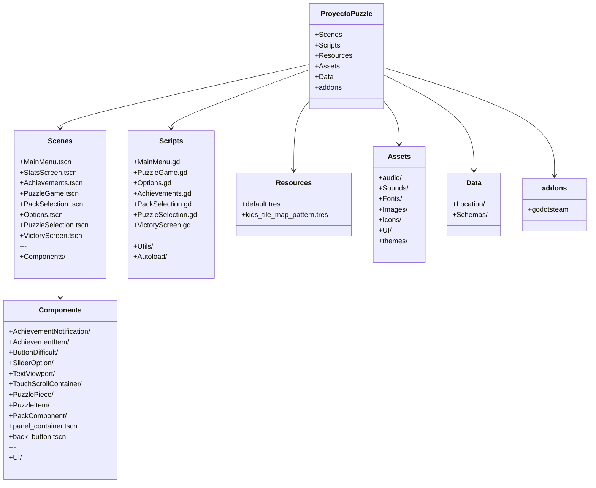

```mermaid
classDiagram
    class ProyectoPuzzle {
        +Scenes
        +Scripts
        +Resources
        +Assets
        +Data
        +addons
    }

    class Scenes {
        +MainMenu.tscn
        +StatsScreen.tscn
        +Achievements.tscn
        +PuzzleGame.tscn
        +PackSelection.tscn
        +Options.tscn
        +PuzzleSelection.tscn
        +VictoryScreen.tscn
        ---
        +Components/
    }

    class Components {
        +AchievementNotification/
        +AchievementItem/
        +ButtonDifficult/
        +SliderOption/
        +TextViewport/
        +TouchScrollContainer/
        +PuzzlePiece/
        +PuzzleItem/
        +PackComponent/
        +panel_container.tscn
        +back_button.tscn
        ---
        +UI/
    }

    class Scripts {
        +MainMenu.gd
        +PuzzleGame.gd
        +Options.gd
        +Achievements.gd
        +PackSelection.gd
        +PuzzleSelection.gd
        +VictoryScreen.gd
        ---
        +Utils/
        +Autoload/
    }

    class Resources {
        +default.tres
        +kids_tile_map_pattern.tres
    }

    class Assets {
        +audio/
        +Sounds/
        +Fonts/
        +Images/
        +Icons/
        +UI/
        +themes/
    }

    class Data {
        +Location/
        +Schemas/
    }
    class addons {
        +godotsteam
    }

    ProyectoPuzzle --> Scenes
    ProyectoPuzzle --> Scripts
    ProyectoPuzzle --> Resources
    ProyectoPuzzle --> Assets
    ProyectoPuzzle --> Data
    ProyectoPuzzle --> addons


    Scenes --> Components
 

    %% Estilos
    classDef project fill:#f9f,stroke:#333,stroke-width:2px
    classDef scenes fill:#bbf,stroke:#333,stroke-width:2px
    classDef components fill:#ddf,stroke:#333,stroke-width:2px
    classDef scripts fill:#bfb,stroke:#333,stroke-width:2px
    classDef resources fill:#fbb,stroke:#333,stroke-width:2px
    classDef assets fill:#ffd,stroke:#333,stroke-width:2px


```